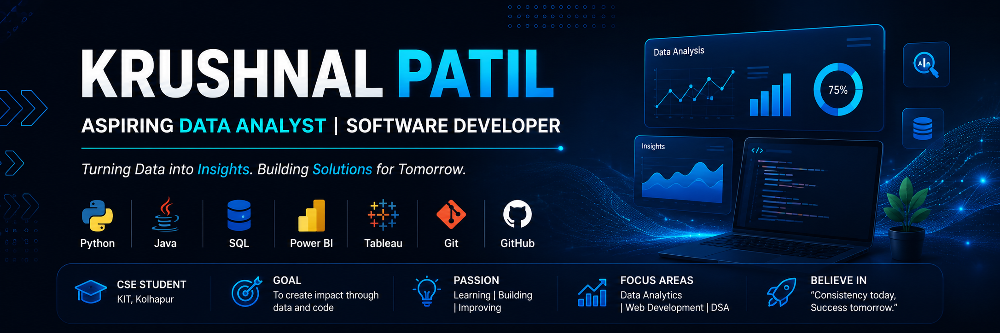

  

<h3 align="center">
Aspiring Data Analyst | Software Developer | CSE Student from India 🇮🇳
</h3>

  

 

  

---

## 👨‍💻 About Me

🎓 B.Tech CSE Student at KIT, Kolhapur

📊 Aspiring Data Analyst & Software Developer

🌱 Currently Learning
- Java
- Data Structures & Algorithms
- SQL
- Power BI

💬 Ask me about
- Python
- SQL
- C
- Data Analytics

📫 Email: **krushnalp2007@gmail.com**

🔗 LinkedIn:
https://linkedin.com/in/krushnal-patil-81741b385

---

## 🛠️ Tech Stack

  

  
  
  

## 📊 GitHub Stats

  
  

## 🔥 Contribution Streak

  

## 🚀 Featured Project

🚀 CareerPilot AI

⭐ AI Career Guidance Platform

✔ Resume Analyzer
✔ Skill Gap Analysis
✔ Learning Roadmap
✔ Interview Preparation

Python • Streamlit • AI

An AI-powered career guidance platform that

- Analyses skills
- Finds skill gaps
- Recommends learning paths
- Reviews resumes
- Prepares students for interviews

  

---

⭐ Thanks for visiting my profile!
